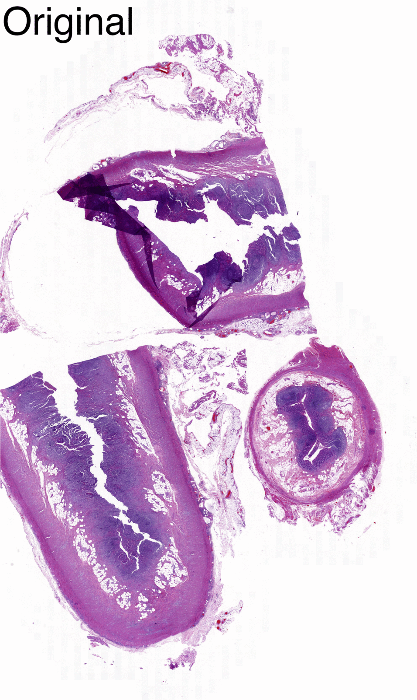

                                                   # WORK IN PROGRESS
# FolDet
Folds detection in Whole slides images


## Abstract
In recent digital pathology studies involving whole-slide images (WSI), researchers avoid tissue artifacts by
manually selecting images or regions-of-interest (ROI). Even though manual selection ensures the quality of
selected tissue regions, it limits the speed and objectivity of analysis by introducing a subjective userinteractive step. 
Moreover, manual selection is a tedious process for large datasets, and thus, their automatic
identification is essential in order to save time and proceed with further analysis. Tissue folding is a common
artifact in histological images that appear when the tissue folds over twice or more by a non-precise cutting
due to defect in the blade edge or when placing it on the microscope slide. The aim of this study is to improve
the visualization and detection of tissue folds from low-pixel resolution images. This information can be used
to determine bad quality tissue slides from good quality tissue slides and therefore, being rejected or
accepted by the algorithm. Here, three automated image analysis methods for identifying tissue folds in
section images are presented and evaluated. The outputs were compared with manually annotated WSI and
evaluated with three different metrics: the widely used Dice score and IoU metrics, and a localization metric
specifically created for this study. Our results showed that the algorithm is able to detect a high percentage
of folds making it possible to standardize a threshold to automate the classification of “Good” and “Folds”
images. Likewise, the huge diversity of tissue types present in this dataset gives a great relevance to this
study, confirming that, although difficult, it is possible to establish a generalized algorithm that works
optimally for the whole dataset.


## Dataset
In order to have an algorithm that correctly detects folds, 220 Whole Slide Images H&E stained **with folds** were used and
220 Whole Slide Images H&E stained **with NO folds** were included to see if the algorithm was accurate with folds-free cases.
In summray, a total of 440 WSI were used for the creation of the algorithm:
- 220 Whole slides images H&E stained labeled as 'with folds' (bad quality) from pathologist
- 220 Whole slides images H&E stained labeled as 'no folds' (good quality) from pathologist

They represented a total of 58 different type of tissues corresponding to 413 patients, including aorta,
appendix, artery, eye, breast, small intestine, duodenum, endometrium, epiglottis, gallbladder, bile duct,
brain, cerebrum, urinary bladder, skin, heart, ileum, jejunum, jaw, bone marrow, colon, larynx, liver, lung,
lymph nodes, stomach, oral cavity, oral mucosa, nose, paranasal sinus, nervous system, kidney, esophagus,
ear, omentum, ovary, pancreas, parotid gland, penis, peritoneum, pharynx, placenta, cervix uteri, prostate,
rectum, seminal vesicle, thyroid gland, skeletal muscle, vocal fold, synovial tissue, tonsils and adenoids,
uterine tube, ureter, urethra, uterus, soft tissue, cecum and tongue.

## FolDet algorithm
<ul>
  <li>Based on Python3 and OpenCV library</li>
  <li>OpenSlide was utilized for reading WSI, and Pillow for basic image manipulation in Python.</li>
  <li>NumPy was used for fast, concise, powerful processing of images as NumPy arrays. </li>
  <li>Scikit-image heavily works with a wide variety of image functionality, such as morphology, thresholding, and edge detection.</li>
</ul>

# Aim
<ul>
  <li>Visualize and detect tissue folds from low-pixel resolution WSI (.png images) and use this information to determine bad quality tissue slides from good quality tissue slides for diagnosis.</li>
  <li>Since the amount of dye absorbed by the tissue is a function of its thickness, the tissue folds being thicker will appear darker (lower luminance) and will express stronger color saturation compared to adjacent non-folded areas. Hence, three color enhancement methods based on the luminance and saturation properties of tissue folds will be described.</li>
  <li>The best from the three proposed algorithms could be optimized for a future use into the diagnostic lab routine as an upgrade for the current quality control process.</li>
</ul>

Developing color filters that can be used to highlight and detect tissue areas can be challenging for a variety of reasons, including:
1. Filters need to be general enough to work across all slides in the dataset.
2. Filters should handle issues such as variations in shadows and lighting.
3. The amount of H&E (purple and pink) staining can vary greatly from slide to slide.
4. Folds colors vary from purple and pink to dark red due to different reasons i.e., thickness, staining duration, blood infiltration in tissue.

The algorithm can be divided into:
  - WSI pre-processing
  - Filter application
  - WSI classification

## 1. Whole slide images pre-processing
a) Retrieve current working directory with ```os.path.abspath(os.getcwd())```
b) Crop and keep only tissue area and do downscaling.
    example:
  <p align="center">
    <kbd>
      
    </kbd>
    <kbd>
      
    </kbd>
    <br>
    <em>Figure 1. Cropped and no cropped WSI</em>
  </p>

## 2. Filter application
### a) Approach 1: Contrast stretch
In the contrast stretch approach we tried to take advantage of low intensity pixel values with the ```rescale_intensity()``` function, that stretches or shrinks the intensity levels of the image given a min and max values. As described before, the in_range parameter defines a linear mapping from the original image to the modified image. The intensity range of the input image can be chosen with in_range parameter and it was the only parameter used for the output image. If the minimum/maximum value of in_range is greater than the maximum and less than the minimum value of the image intensity, the intensity level will be clipped, that is, only the intensity level within the range of in_range will be retained.
In order to choose the minimum/maximum value of in_range, we need to have insights regarding the folds intensity values.
<p align="center">

  <br>
  <em>Figure 2. On the left, the original image. On the right, example of extracting intensity values from a grayscale image (a). 
    A mask (b) was applied to the original image (c) to better visualize the intensity values of tissue folds in the histogram (d).</em>
</p>

After that, to extract the binary mask, we passed the output image to the cv2.threshold() function with a threshold of 200 in order to get rid of most of gray areas (tissue area) and leave with darker areas (folds).  Next, we proceed with morphological transformations that we can perform based on the image's shape. These methods are called “closing” and “opening” and tend to come in pairs. The aim of opening is to eliminate false positives. Usually there are several pixels of "noise" in the background, and the idea of "closing" is to eliminate false negatives. Essentially, this is where you have the observed shape, such as our masks, but there are still some black pixels inside the object. Closing would try to clear this up.

<p align="center">

  <br>
  <em>Figure 3. Contrast stretch workflow</em>
</p>

### b) Approach 2: HSV
<ul>
  <li>In HSV, it is easier to represent a color than in RGB color-space:</li>
  <ol>
    <li>Unlike RGB, HSV separates luma, or the image intensity, from chroma or the color information.</li>
    <li>The RGB color information is usually much noisier than the HSV information</li>
  </ol>

  <li>One of the most efficient ways to increase an image's color contrast while keeping its hue (color) is to convert the image's original RGB color to HSV (hue, saturation, value) color space and use only the saturation channel or luminance portion of its pixel.</li>
  <li>Saturation and luminance enhancement are traditionally accomplished by performing forward and reverse color transformations between the RGB and HSV color spaces:</li>
  <ol>
    <li>The original RGB colors of the pixels are transformed into their HSV color equivalents in the forward color transformation, where the color saturation or luminance of the image pixels is showed.</li>
    <li>The reverse color transition, from HSV to RGB, is then done to see the result of the change (enhanced image).</li>
  </ol>
</ul>

#### BGR2HSV
To produce an image that is only in the saturation channel, we must first convert our BGR image to HSV color space using ```cv2.COLOR_BGR2HSV``` method and then split the HSV channels and pick the saturation one using ```hsv[:,:,1]```.

<p align="center">

  <br>
  <em>Figure 4. Example of channel’s types in HSV color space. In order: Hue, Saturation, Value.</em>
  <br>
</p>

The resulting image is then read in grayscale mode and thresholded with the method ```cv2.THRESH_BINARY``` of ```cv2.threshold()```. With the performance of the previous method, the thresholding no longer needs to be strong. The above will generate a binary mask, which will be used for object detection in ```cv2.findContours()```. The ```cv2.drawContours()``` function is used to visualize the detected folds. 

<p align="center">
&nbsp;&nbsp;
  <br>
  <em>Figure 5. HSV workflow</em>
</p>

### c) Approach 2: Brightness enhanced
Contrast enhancement (CE) refers to the image enhancement on contrast by adjusting the dynamic range of pixel intensity distribution. CE plays an important role in the improvement of visual quality for computer vision, pattern recognition and digital image processing. In real applications, we usually encounter digital images with poor contrast or abnormal brightness, which may result from different factors, such as the deficiency of imaging devices. The capturing scenes with low or high illuminance intensity may also lead to reduced contrast quality. Despite of visual quality degradation, low contrast might hinder the further applications of a digital image, including image analysis and object recognition. As such, it is essential to enhance the contrast and brightness of such distorted images before further applications.

A. ImageEnhance.Brightness
In this step we used the function ```ImageEnhance.Brightness()``` from the Python Imaging Library (PIL). This class can be used to control the brightness of an image, i.e., an enhancement factor of 0.0 gives a black image, while a factor of 1.0 gives the original image. First of all, it is required to create an object of the corresponding class in order to enhance the image, enhancer = ImageEnhance.Brightness(im), second enhancer.enhance(factor) is used for the enhancing. Figure 6 displays the difference between a standard enhancing factor of 1.5 and 2. In this approach, a factor of 2 was selected.

<p align="center">

  <br>
  <em>Figure 6. Example of enhanced brightness. On the left the original RGB image, at the center the same image with an enhancing factor of 1.5 and 2 on the right.</em>
</p>

B.	pil_to_np_rgb()
To mathematically manipulate the images, we use NumPy arrays. The util.py file contains a pil_to_np_rgb() function that converts a PIL Image with shape (width , height) to a 3-dimensional NumPy array in RGB format (height, width, 3). The first dimension represents the number of rows, the second dimension represents the number of columns, and the third dimension represents the channel (red, green, and blue). 

C.	filter_rgb_to_grayscale()
Next step is to convert an RGB image to a grayscale image. In this process, the three-color channels are replaced by a single grayscale channel. The grayscale pixel value is computed by combining the red, green, and blue values in a set of percentages. The filter_rgb_to_grayscale() function multiplies the red value by 21.25%, the green value by 71.54%, and the blue value by 7.21%, and these values are added together to obtain the grayscale pixel value.
Although the PIL Image convert("L") function can also be used to convert an RGB image to a grayscale image, we will instead use the filter_rgb_to_grayscale() function, since having a reference to the RGB image as a NumPy array can often be very useful during image processing.

D.	filter_contrast_stretch()
The last filter we apply to the image for a better visualization of tissue folds is contrast stretch.
Contrast is a measure of the difference in intensities. An image with low contrast is typically dull and details are not clearly seen visually. An image with high contrast is typically sharp and details can clearly be discerned. Increasing the contrast in an image can be used to bring out various details in the image. In this case, this was achieved by using contrast stretching. Assuming that all intensities in an image occur between 100 and 150 on a scale from 0 to 255, if we rescale the intensities so that 100 now corresponds to 0 and 150 corresponds to 255, the details within this intensity range will be better perceived as the contrast has been increase. In our case, as folds have darker intensity values, we performed the contrast stretching with a low pixel value of 0 and a high pixel value of 2, spreading out this range across the full spectrum.
At this point, the program will automatically create a new Enhanced directory with two sub-directories: Enhanced folds and Enhanced good where the images will be saved, respectively.
Below, the contrast stretched image resulting after brightness enhancing is shown.

<p align="center">

  <br>
  <em>Figure 7. Summary of resulting images up to contrast stretch. 
    The image on the right is obtained with rescale_intensity function, which boost contrast by "stretching" intensity between given min and max and clipping the rest.</em>
</p>

E. cv2.threshold(img,180,255,cv2.THRESH_BINARY)
A binary image is an image that consists of only two values (True or False, 1.0 or 0.0, 255 or 0). With basic thresholding, a binary image is generated, where each value in the resulting NumPy array indicates whether the corresponding pixel in the original image is above a particular threshold value. For every pixel, the same threshold value is applied. If the pixel value is smaller than the threshold, it is set to 0, otherwise it is set to a maximum value. The function ```cv2.threshold()``` is used to apply the thresholding.

F. ndimage.binary_fill_holes(complement, structure=np.ones((5,5))).astype(int)
Once we obtained our binary mask, we used the SciPy ndimage.morphology module for a more homogeneous folds shape. This function fills the holes in binary objects using a kernel of 5x5 shape and filled with ones. A Kernel tells you how to change the value of any given pixel by combining it with different amounts of the neighboring pixels. The kernel is applied to every pixel in the image one-by-one to produce the final image. 

Having a more uniform shape makes the next step easier and more reliable. An example of thresholded and binary_fill_holes mask is shown in Figure 8.

<p align="center">

  <br>
  <em>Figure 8. An example of thresholded and binary fill holes mask. The arrows indicate where the hole was present and efficiently filled in the binary mask.</em>
</p>

G.	cv2.medianBlur()
Here, the function ```cv2.medianBlur()``` takes the median of all the pixels under the kernel area and the central element is replaced with this median value. This is highly effective against salt-and-pepper noise in an image. Interestingly, this problem, present in the binary image resulting from above thresholding, was successfully solved with this function. In median blurring, the central element is always replaced by some pixel value in the image, reducing the noise effectively. Its kernel size should be a positive odd integer, in this case, in order to avoid folds fades, a kernel size of 3 was used. After smoothing the image, the final mask was extracted with ```cv2.threshold()``` and saved in Noise reduction folder. The Figure 9 shows the resulting images. 

<p align="center">

  <br>
  <em>Figure 9. Example of binary mask before and after noise reduction.</em>
</p>

H.	cv2.findContours(src, cv2.RETR_EXTERNAL, cv2.CHAIN_APPROX_SIMPLE)
The last step of Approach 1 involves the use of OpenCV library that provide cv2.findContours() module for object detection. Contours can be explained simply as a curve joining all the continuous points (along the boundary), having same color or intensity. For better accuracy, we used binary images. 
In OpenCV, finding contours is like finding white object from black background. So, the object to be found should be white and background should be black. There are three arguments in cv2.findContours() function, first one is source image, second is contour retrieval mode, third is contour approximation method. The function outputs the contours and hierarchy. Contours is a Python list of all the contours in the image. Each individual contour is a Numpy array of x and y coordinates of boundary points of the object. There are two main options for the third argument: cv2.CHAIN_APPROX_NONE and cv2.CHAIN_APPROX_SIMPLE. The former stores all the boundary points of an object but since we just need two end points of a specific object to represent it, cv2.CHAIN_APPROX_SIMPLE was chosen. The latter removes all redundant points and compresses the contour, thereby saving memory.
Eventually, for a visualization purposes, cv2.drawContours() function is used to draw the contours using the boundary points. Its first argument is the source image, second argument is the contours which should be passed as a Python list, third argument is index of contours (useful when drawing individual contour). To draw all contours, we passed -1 and remaining arguments are color and thickness of the contour line.
The resulting and final images are saved inside Enhanced folds folder in the new folder Result folds. An example is shown in Figure 10.

<p align="center">

  <br>
  <em>Figure 10. Example of contouring the folds detected. On the left, the original RGB image; on the right the detected folds in green.</em>
</p>


